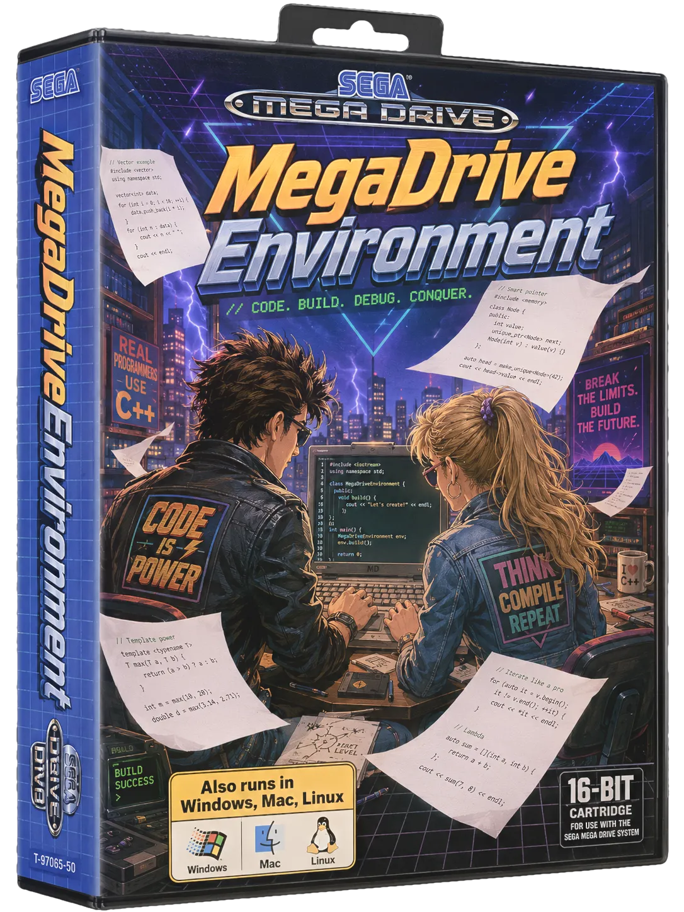
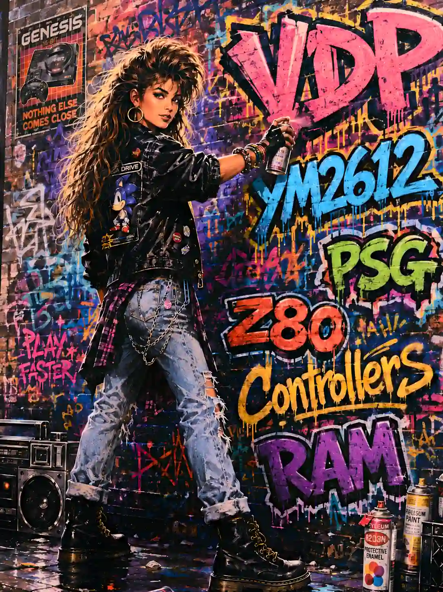
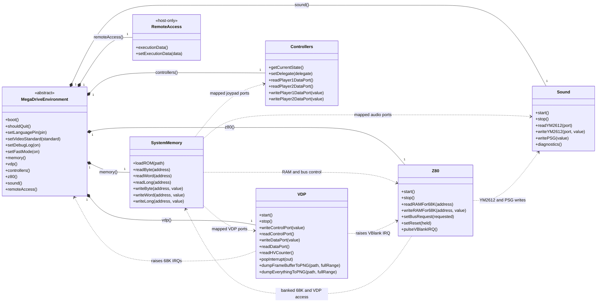
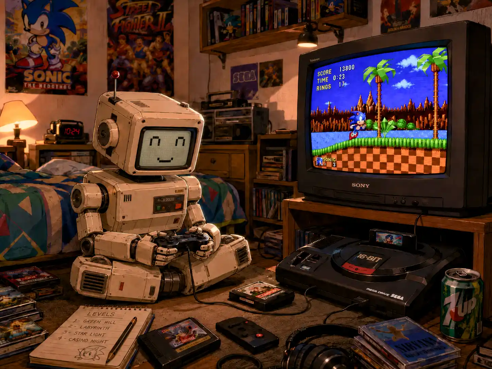

# MegaDriveEnvironment

<p align="center">
  
</p>

Develop Sega Mega Drive / Genesis software as a normal C++23 application on
your PC, with the hardware-facing parts of the program connected to a focused
Mega Drive runtime.

`MegaDriveEnvironment` shortens the inner development loop. Game code runs
natively, so the debugger, profiler, sanitizers, logs and IDE all work as they
would for any other desktop program. Around that code, the environment models
the memory map, VDP, 3-button controllers, Z80, YM2612 and PSG closely enough to
develop and inspect real hardware-style interactions.

The environment is deliberately **not a complete, cycle-accurate console
emulator**, and it does not turn arbitrary desktop C++ into a ROM. It is the PC
side of a portable game architecture. A real-hardware target still needs its
own startup code, linker layout, target memory access and cross-toolchain. The
[`MegaDriveEnvironmentSampleGame`](https://github.com/RuiNelson/MegaDriveEnvironmentSampleGame)
demonstrates that complete two-target workflow.

## Documentation map

- [MegaDriveEnvironment](#megadriveenvironment)
  - [Documentation map](#documentation-map)
  - [Why use it?](#why-use-it)
  - [Current scope](#current-scope)
  - [Runtime architecture](#runtime-architecture)
  - [Getting started](#getting-started)
    - [Requirements](#requirements)
    - [Build and test](#build-and-test)
    - [Add it to a CMake project](#add-it-to-a-cmake-project)
    - [Minimal host application](#minimal-host-application)
  - [Memory and hardware access](#memory-and-hardware-access)
    - [Host memory is not console memory](#host-memory-is-not-console-memory)
  - [VDP and frame timing](#vdp-and-frame-timing)
    - [Synchronization modes](#synchronization-modes)
    - [Scaling modes](#scaling-modes)
  - [Controllers and configuration](#controllers-and-configuration)
  - [Sound and Z80](#sound-and-z80)
    - [YM2612 (ymfm)](#ym2612-ymfm)
    - [PSG and host mixing](#psg-and-host-mixing)
    - [Z80](#z80)
  - [Debugging tools](#debugging-tools)
    - [Remote access and automation](#remote-access-and-automation)
  - [Portability to real hardware](#portability-to-real-hardware)
  - [Reference](#reference)
    - [Public API map](#public-api-map)
    - [Repository layout](#repository-layout)
    - [License](#license)

## Why use it?

- Debug game code with native breakpoints, stepping and memory inspection.
- Keep the Mega Drive's 24-bit, big-endian address space visible to the game.
- Exercise VDP ports, planes, sprites, scrolling, DMA and interrupts.
- Read keyboard or gamepad input through the original 3-button joypad protocol.
- Run Z80 programs and send timestamped writes to the YM2612 and PSG.
- Capture the current frame or a full VDP diagnostic image without enabling
  expensive per-frame debug output.
- Reuse portable game logic in a separate real-hardware build instead of
  maintaining a disposable PC-only renderer and input layer.

## Current scope

<p>
  
</p>

| Area | Implemented behaviour |
| --- | --- |
| 68000 execution | Native C++ game code on a dedicated CPU thread; no 68000 interpreter or register-file emulation (recompilation hosts supply their own) |
| System memory | 24-bit address normalization, 4 MiB ROM, 64 KiB Work RAM, big-endian byte/word/long access and mapped-device routing |
| VDP | Mode 5 ports and registers, VRAM/CRAM/VSRAM, planes A/B, window, scrolling, linked sprites, priorities, sprite limits/collision, DMA, H/V counters, HBlank/VBlank events, interlace and shadow/highlight |
| Video output | SDL3 window, integer/fitted scaling, internal 50/60 Hz timer or display VSync modes, PNG captures |
| Controllers | Two configurable keyboard/gamepad players exposed through the active-low 3-button protocol |
| Sound | YM2612 through ymfm, SN76489-compatible PSG, 48 kHz output and timestamped non-blocking event delivery |
| Z80 | Z80 core, 8 KiB RAM, banked 68000 access, bus request/reset and VBlank IRQ |
| Region | Language and 50/60 Hz pins through the hardware version register |

Accuracy is feature-driven. Unimplemented hardware ranges currently behave as
safe stubs, and host thread scheduling is not a substitute for console timing.
Always validate a release ROM in an independent emulator and on real hardware.

## Runtime architecture

The root object is `MegaDriveEnvironment`. Derived applications implement
`run()` (and optional VDP interrupt handlers); the environment owns the
subsystems and exposes them through public accessors.



The diagram intentionally stops at the public boundary. The filled diamonds
identify the subsystem returned by each public accessor; private implementation
objects are omitted. Dotted arrows show runtime calls between those public
subsystems. `MegaDriveEnvironment` exposes them to derived applications through
these accessors:

```cpp
memory();      // SystemMemory
vdp();         // VDP
controllers(); // Controllers
z80();         // Z80
sound();       // Sound
remoteAccess(); // RemoteAccess (host-only debugging and automation)
```

`RemoteAccess` owns an opaque execution-data buffer which game code can fill
with arbitrary debugging bytes (for example text, JSON, or a custom binary
record). Remote clients can retrieve a consistent copy or replace the complete
buffer. This is strictly a host-side debugging facility: it is **not** Mega
Drive hardware, is not mapped into the 68000 or Z80 address spaces, and does
not exist in a real-hardware build.

Any game code shared with a console target must therefore keep calls to this
API behind an application-defined compile-time guard. Define the macro only
for the native `MegaDriveEnvironment` target:

```cpp
#ifdef ENABLE_MDE_HOST_DEBUG
std::vector<std::uint8_t> debugData = buildDebugRecord();
remoteAccess().setExecutionData(debugData);
#endif
```

Leaving `ENABLE_MDE_HOST_DEBUG` undefined for ROM/real-hardware builds prevents
the host-only API from leaking into portable game logic. Reading the buffer
from game code follows the same rule and returns a snapshot:

```cpp
#ifdef ENABLE_MDE_HOST_DEBUG
const auto debugData = remoteAccess().executionData();
#endif
```

The important threading rules are:

- `run()` executes on the CPU thread.
- SDL events, window presentation and `handleOptionHotkey()` execute on the
  main thread.
- VDP rendering and interrupt scheduling execute on the VDP thread.
- The Z80 has its own execution thread; audio rendering is driven by SDL's
  audio callback.
- Public mapped-memory, VDP-port and controller operations are synchronized.
  Your own game objects are not automatically thread-safe.
- If an option hotkey or callback touches CPU-thread state, add explicit
  synchronization or send a message to the CPU thread.

## Getting started

<p>
  
</p>

### Requirements

- [CMake](https://cmake.org/) 3.24 or newer;
- a C++23 compiler;
- [SDL3](https://wiki.libsdl.org/SDL3/FrontPage) installed where CMake can find
  its package configuration;
- Git and network access during the first configure, while CMake fetches
  `yaml-cpp`, `zlib` and `libpng`.

The project builds on macOS and other desktop platforms supported by its
dependencies. Compiler and SDL3 availability ultimately determine whether a
particular host configuration is supported.

### Build and test

```bash
git clone https://github.com/RuiNelson/MegaDriveEnvironment.git
cd MegaDriveEnvironment

cmake -S . -B build -DCMAKE_BUILD_TYPE=Debug
cmake --build build --parallel
ctest --test-dir build --output-on-failure
```

This repository builds a **shared** library by default (faster incremental
rebuilds for games that only touch environment sources). Pass
`-DMEGADRIVE_ENVIRONMENT_BUILD_SHARED=OFF` for a static archive. FetchContent
host deps (`yaml-cpp`, `zlib`, `libpng`) default to static; pass
`-DMEGADRIVE_ENVIRONMENT_SHARED_DEPS=ON` to build and link them as shared
libraries instead. The library is normally consumed by a game or tool rather
than launched by itself. To see a complete runnable project:

```bash
cd ..
git clone https://github.com/RuiNelson/MegaDriveEnvironmentSampleGame.git
cd MegaDriveEnvironmentSampleGame
./build_pc.sh
./run_pc.sh
```

Keep the two repositories side by side for the sample's default configuration,
or set its `MEGADRIVE_ENVIRONMENT_DIR` variable.

### Add it to a CMake project

```cmake
cmake_minimum_required(VERSION 3.24)
project(MyMegaDriveGame LANGUAGES CXX)

set(CMAKE_CXX_STANDARD 23)
set(CMAKE_CXX_STANDARD_REQUIRED ON)

add_subdirectory(
    "../MegaDriveEnvironment"
    "${CMAKE_BINARY_DIR}/MegaDriveEnvironment"
)

add_executable(my_game src/main.cpp)
target_link_libraries(my_game PRIVATE
    MegaDriveEnvironment::MegaDriveEnvironment
)
```

Public headers are included from `include/MegaDriveEnvironment`:

```cpp
#include "system/MegaDriveEnvironment.hpp"
#include "system/graphics/VDP.hpp"
#include "system/memory/SystemMemory.hpp"
```

### Minimal host application

Derive one application object from `MegaDriveEnvironment`, choose the VDP
timing/scaling policy, implement `setup()`, `loop()` and the VDP interrupt
handlers, then call `boot()` on the main thread:

```cpp
#include "system/MegaDriveEnvironment.hpp"

class MyGame final : public MegaDriveEnvironment {
  public:
    MyGame()
        : MegaDriveEnvironment(
              VDP::InternalTimer,
              VDP::Integer,
              VDP::HardwareSpriteLimit) {
    }

  private:
    void run() override {
        // run() executes on the environment's CPU thread.
        setup();
        while (1) {
            loop();
        }
    }

    void setup() {
        // Initialize game state and hardware here.
    }

    void loop() {
        // Update game state and access mapped hardware here.
    }

    void vSync() override {
        // Handle the vertical-blank interrupt once per frame.
    }

    void hSync(int line) override {
        // Handle the horizontal-blank interrupt for this scanline.
        (void)line;
    }
};

int main() {
    MyGame game;
    game.boot(); // blocks while the SDL event loop and game are running
}
```

`boot()` owns the runtime lifecycle: it starts the VDP, audio and Z80, runs
`run()` on a dedicated CPU thread, and keeps SDL event processing and frame
presentation on the calling thread. Closing the window or pressing `Ctrl+Q`
sets `shouldQuit()`; cooperative game loops should observe it and return.

For a practical VBlank-driven loop, VDP initialization, assets and a portable
memory adapter, use the Sample Game rather than growing the minimal snippet
into a second tutorial.

## Memory and hardware access

<p>
  
</p>

`SystemMemory` is the central compatibility boundary. It normalizes addresses
to 24 bits, preserves Motorola big-endian ordering and routes mapped accesses
to the owning subsystem:

```cpp
auto &bus = memory();

bus.writeWord(0x00C00004, 0x8174); // VDP control-port write
const auto status = bus.readWord(0x00C00004);
const auto p1 = bus.readByte(0x00A10003);
```

For code intended to run on both PC and real hardware, prefer a small shared
memory contract whose PC implementation delegates to `SystemMemory` and whose
Mega Drive implementation performs direct volatile bus access. That keeps game
code independent of SDL and prevents a second hardware-specific game loop.

Key mapped ranges:

| Address | Behaviour |
| --- | --- |
| `$000000–$3FFFFF` | Loaded ROM image, read-only after `loadROM()` |
| `$A00000–$A01FFF` | Z80 RAM as observed by the 68000 |
| `$A04000–$A04003` | YM2612 ports |
| `$A10001` | Hardware version / region pins |
| `$A10003–$A1000B` | Player data and control ports |
| `$A11100`, `$A11200` | Z80 bus request and reset |
| `$C00000–$C0000F` | VDP data, control/status and H/V-counter ports |
| odd bytes `$C00011–$C00017` | PSG writes |
| `$FF0000–$FFFFFF` | 64 KiB 68000 Work RAM |

`loadROM(path)` accepts up to 4 MiB. Larger files are reported and truncated;
an unreadable file is reported and leaves the existing ROM contents unchanged.

### Host memory is not console memory

Native C++ objects, the host heap and the PC thread stack do **not** consume
emulated Work RAM. This is useful for development, but it can hide real-hardware
stack overflow or memory-budget errors. Portable projects should establish
explicit budgets for the 64 KiB Work RAM, avoid accidental dynamic allocation
in shared code, and test the final target early. The
[Sample Game README](https://github.com/RuiNelson/MegaDriveEnvironmentSampleGame#memory-management-and-the-64-kib-work-ram-budget)
contains a more detailed discussion of stack, pools and decompression buffers.

## VDP and frame timing

The VDP can be reached through the memory map or directly through `vdp()`. Use
mapped access when sharing the code with a Mega Drive build; use the direct API
for environment-specific tools and diagnostics.

### Synchronization modes

| Mode | Use |
| --- | --- |
| `VDP::InternalTimer` | Recommended for games. Runs from the selected region's internal 60 Hz or 50 Hz deadline and is independent of monitor refresh rate. |
| `VDP::VSync` | Presents one emulated frame per monitor refresh. Useful when that refresh rate is already appropriate. |
| `VDP::VSync2` | Holds each frame for two monitor refreshes. |
| `VDP::VSync3` | Holds each frame for three monitor refreshes. |

Select region pins before `boot()` when needed:

```cpp
game.setLanguagePin(MegaDriveEnvironment::LanguagePin::Overseas);
game.setVideoStandard(MegaDriveEnvironment::VideoStandard::Hz50);
```

### Scaling modes

- `VDP::Integer`: largest integer scale that fits the usable display;
- `VDP::Fit`: resizable fitted output with bilinear filtering;
- `VDP::Scale1x`, `Scale2x`, `Scale3x`: fixed initial scales with nearest-neighbour
  filtering.

`VDP::HardwareSpriteLimit` clips excess sprites like the hardware while still
reporting overflow state. `VDP::QuasiUnlimitedSprites` is useful for debugging
sprite tables without hiding entries behind the per-line limit.

## Controllers and configuration

`Controllers` loads `controls.yaml` once during construction. If the file is
missing or malformed, Player 1 uses the defaults below and Player 2 is disabled.

| Mega Drive input | Default keyboard input |
| --- | --- |
| D-pad | Arrow keys |
| A | `Z` |
| B | `X` |
| C | `C` |
| Start | `V` |

Games intended for real hardware should read the active-low controller data
ports and drive the TH line exactly as they would on the console. The
`Controllers` class translates configured keyboard/gamepad state into that
3-button protocol at `$A10003/$A10005`.

Applications can expose the built-in configuration UI:

```cpp
#include "config/controls/ControlsConfigUI.hpp"
#include <string_view>

int main(int argc, char **argv) {
    if (argc == 2 && std::string_view{argv[1]} == "--config-controls") {
        runControlsConfig(); // blocks, then saves controls.yaml on Exit
        return 0;
    }

    MyGame game;
    game.boot();
}
```

Run the application from a stable working directory: `controls.yaml` and PNG
captures are stored relative to that directory. Gamepad bindings persist by
GUID and are resolved to the current SDL session when the environment starts.

## Sound and Z80

The mapped sound path mirrors the console architecture:

- 68000 or Z80 writes to `$A04000–$A04003` reach the YM2612;
- odd-byte writes in `$C00010–$C00017` reach the PSG;
- Z80 RAM, bus request, reset and VBlank IRQ are modelled;
- writes from different producers are stamped on a shared master-cycle
  timeline;
- the YM2612 is advanced on the SDL audio callback thread; the PSG runs on a
  dedicated `md-psg` worker that fills a SPSC sample ring mixed at callback time;
- gameplay-facing audio writes do not block the producer thread once real-time
  audio is active. Under contention or queue pressure, diagnostics report
  dropped events rather than stalling the game.

### YM2612 (ymfm)

FM synthesis for the YM2612 is provided by **[ymfm](https://github.com/aaronsgiles/ymfm)**,
Aaron Giles' BSD-licensed Yamaha FM core (the same family of cores used in MAME).
A vendored copy lives under:

- `include/MegaDriveEnvironment/system/sound/mame_ymfm/`
- `src/system/sound/mame_ymfm/`

The environment drives `ymfm::ym2612` at the Mega Drive master-clock-derived
YM2612 rate, mixes it with a host SN76489-compatible PSG implementation, and
outputs stereo audio at 48 kHz through SDL3. Host code does not need to talk to
ymfm directly; use the mapped ports or the `Sound` helpers.

### PSG and host mixing

The SN76489-style PSG is implemented inside `Sound` (not part of ymfm). It models
the **Mega Drive integrated (ASIC) SN76489A clone** with:

- master-cycle-accurate tone/noise generators (`(master/15)/16` half-period units);
- period `0` ≡ `1` (integrated behaviour, not the discrete `0x400` quirk);
- 16-bit LFSR white/periodic noise with taps 0⊕3, shifted on the rising edge only;
- 2 dB attenuation table and ~1.5× PSG preamp (VA4 MD1 FM/PSG balance);
- sample-period integration so square/noise edges are anti-aliased at 48 kHz.

In realtime mode the PSG chip and its write queue live on a dedicated thread
(`md-psg`); the audio callback only pops pre-rendered stereo frames from the
PSG ring and mixes them with FM. Headless diagnostics keep both chips
synchronous on the calling thread.

PSG and FM streams are preamplified, mixed, lightly filtered and delivered on
the shared master-cycle timeline described above.

### Z80

The Z80 subsystem uses **[SUZUKI PLAN - Z80 Emulator](https://github.com/suzukiplan/z80)**
(MIT, Yoji Suzuki), a single-header C++ core vendored under
`include/MegaDriveEnvironment/system/z80/suzukiplan/`. It owns 8 KiB of Z80 RAM,
banked access into the 68000 map, bus request/reset and VBlank IRQ delivery so
sound drivers can run as they would on hardware.

Environment-only code may call `sound().writeYM2612()` and
`sound().writePSG()` directly. Shared game code should use memory-mapped ports
so the same sound routine remains valid on real hardware.

## Debugging tools

<p>
  
</p>

Because the executable is native, launch it directly under LLDB, GDB or your
IDE. CMake exports `compile_commands.json`, which language servers can consume.

Built-in host shortcuts:

| Shortcut | Action |
| --- | --- |
| `Ctrl+Q` | Request shutdown |
| `Ctrl+R` | Cold-restart the game while preserving the process and loaded ROM |
| `Ctrl+P` | Save the composed frame as `screenshot_NNN.png` |
| `Ctrl+S` | Save the full VDP diagnostic sheet as `vpd_NNN.png` |
| `Alt/Option` + key or gamepad button | Call `handleOptionHotkey()` without changing emulated joypad state |

The full VDP sheet contains the frame, tile sheets, plane name tables, palette,
VSRAM, window/sprite views and registers. The mouse cursor is hidden while the
VDP window is fullscreen and restored on exit.

### Remote access and automation

Applications also expose an optional single-client binary TCP automation
service for controller input, system-bus memory, and VDP inspection. It listens
on port 6969 by default; pass port `0` as the fourth `MegaDriveEnvironment`
constructor argument to disable it. The wire format is documented in
[`docs/remote-access-protocol.md`](docs/remote-access-protocol.md).

A typed, dependency-free Python client is available under [`python/`](python/):

```bash
python3 -m pip install ./python
```

```python
from megadrive_remote import Buttons, MegaDriveClient

with MegaDriveClient() as mega_drive:
    mega_drive.press_buttons(player1=Buttons.A | Buttons.START, frames=2)
    print(mega_drive.get_game_uptime_ms())
    print(mega_drive.get_execution_data())
    frame = mega_drive.read_framebuffer()
```

Additional runtime controls:

```cpp
game.setDebugLog(true); // once-per-second runtime/audio diagnostics
game.setFastMode(true); // skip CPU-side pacing for bring-up and validation
```

Fast mode is intentionally not timing-accurate. Use it to find logic bugs, not
to judge play speed, raster effects or audio behaviour.

## Portability to real hardware

<p>
  
</p>

MegaDriveEnvironment makes shared code practical; it cannot make host-only C++
portable automatically. Keep the boundary explicit:

**Usually shared**

- game state and object model;
- collision, movement and scoring;
- tile/sprite/palette command generation;
- controller protocol and sound command logic;
- a target-neutral memory interface.

**Target-specific**

- PC `main()` and `MegaDriveEnvironment` adapter;
- Mega Drive reset/header/interrupt startup;
- direct bus access and linker/ROM layout;
- freestanding runtime, allocation policy and memory initialization.

The Sample Game compiles the same gameplay and VDP code for both targets and is
the recommended starting point for a new project.

## Reference

### Public API map

| Header | Purpose |
| --- | --- |
| [`system/MegaDriveEnvironment.hpp`](include/MegaDriveEnvironment/system/MegaDriveEnvironment.hpp) | Lifecycle, subsystem ownership, region, pacing and host hooks |
| [`system/memory/SystemMemory.hpp`](include/MegaDriveEnvironment/system/memory/SystemMemory.hpp) | 24-bit bus, ROM/Work RAM and mapped-device routing |
| [`system/graphics/VDP.hpp`](include/MegaDriveEnvironment/system/graphics/VDP.hpp) | VDP ports, synchronization, scaling, interrupts and PNG diagnostics |
| [`system/controllers/Controllers.hpp`](include/MegaDriveEnvironment/system/controllers/Controllers.hpp) | Input state and 3-button port protocol |
| [`system/sound/Sound.hpp`](include/MegaDriveEnvironment/system/sound/Sound.hpp) | YM2612/PSG access and audio diagnostics |
| [`system/z80/Z80.hpp`](include/MegaDriveEnvironment/system/z80/Z80.hpp) | Z80 RAM, bus/reset and execution lifecycle |
| [`config/controls/ControlsConfigUI.hpp`](include/MegaDriveEnvironment/config/controls/ControlsConfigUI.hpp) | Interactive keyboard/gamepad binding UI |

### Repository layout

```text
include/MegaDriveEnvironment/  Public consumer headers
src/                           Runtime implementation
assets/                        Example/source art
docs/                          Supporting project documentation
tests/                         Focused automated tests
tools/                         Asset and development utilities
LICENSE                        Project MIT license
THIRD_PARTY_NOTICES.md         Vendored and dependency license notices
```

When changing emulated behaviour, add a focused test where possible and verify
the result against independent emulator documentation or real hardware. The
fast native loop is most valuable when it remains honest about where hardware
validation still matters.

### License

MegaDriveEnvironment is released under the [MIT License](LICENSE).
Copyright (c) 2026 Rui Carneiro.

Third-party code and host dependencies keep their own terms. In particular:

- **ymfm** (YM2612) — BSD 3-Clause, Copyright (c) 2021 Aaron Giles;
- **SUZUKI PLAN Z80** — MIT, Copyright (c) 2019 Yoji Suzuki;
- **SDL3**, **yaml-cpp**, **zlib** and **libpng** — obtained at build time under
  their upstream licenses.

Full text and paths for vendored components are in
[`THIRD_PARTY_NOTICES.md`](THIRD_PARTY_NOTICES.md). When redistributing
binaries that include this library, retain the MIT notice from `LICENSE` and
reproduce the applicable third-party notices.
